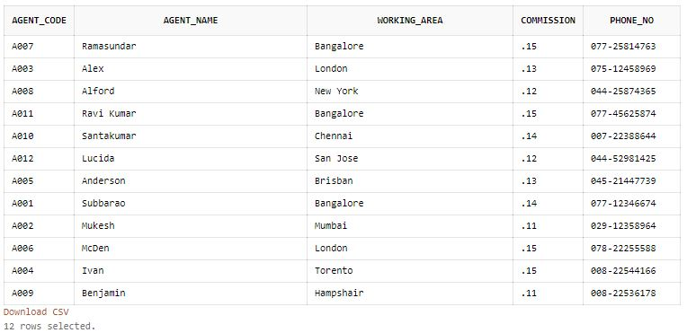
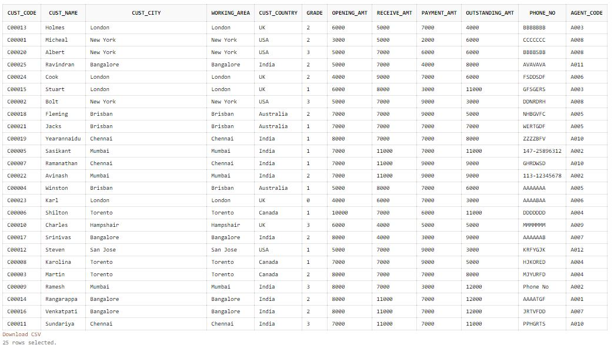

[Home](README.md) - [Code Review](CodeReview.md) - [Data Structures and Algorithms](data_structures.md) - [Software Engineering and Design](softeng_design.md) - [Databases](databases.md)

<h1> Databases </h1>

## Narrative

My original plan was to create a database either using my family or possibly a jail inmate database. I would use fake names and information. I then found access to a database using premade information that I could mold. Using SQL, I created the Database using the instructions listed below. This will create two tables filled with information for a small business. One will hold Agent information as the other will hold customer information. 


<center></center>

<center></center>
  
  
## Enhancement

Enhancements have been made to a pre-existing database set. The database is for an insurance company. It is storing information on their agents, customers, and now order information. This is a great example of a real-life database that would be used in the everyday working environment. Anything that represents the everyday inner workings of small businesses is a great way to see how powerful these programs can be.

I believe I have met the objectives given. I wanted to enhance the project by showcasing my ability to manipulate the database information as well as expand on the already set base of information. A column from the Agents table was removed and a new table was created for orders to expand the use of the database. This has been the most interesting artifact so far for me. As I look back on the course where I was introduced to SQL, I wasn’t a fan of it at the time. I felt overwhelmed at first but I hung in there and was able to finish the course with a better understanding. Revisiting SQL with this database. I have found that I really enjoyed manipulating the tables and felt comfortable early on. Like anything you haven't mastered, I ran into a speed bump here and there due to syntax and simple wording. Just had remind myself of the proper wording to manipulate the database and things started to move forward. As I get more practice with it, I am becoming more confidant.


The enhancements below shows us altering the Agents table by removing a column and creating a new table called orders. 


```
/* To delete the section of "country (enhancement) */
ALTER TABLE Agents DROP(country);

/* To veiw Agents table to see "country" now gone(enhancement)*/
SELECT * FROM Agents

/*Create a new table for "orders" (enhancement)*/
CREATE TABLE  "ORDERS" 
   (
        "ORD_NUM" NUMBER(6,0) NOT NULL PRIMARY KEY, 
	"ORD_AMOUNT" NUMBER(12,2) NOT NULL, 
	"ADVANCE_AMOUNT" NUMBER(12,2) NOT NULL, 
	"ORD_DATE" DATE NOT NULL, 
	"CUST_CODE" VARCHAR2(6) NOT NULL REFERENCES CUSTOMER, 
	"AGENT_CODE" CHAR(6) NOT NULL REFERENCES AGENTS, 
	"ORD_DESCRIPTION" VARCHAR2(60) NOT NULL
   );

/* insert vaules for Orders table (enhancement)*/
INSERT INTO ORDERS VALUES('200100', '1000.00', '600.00', '08/01/2008', 'C00013', 'A003', 'SOD');
INSERT INTO ORDERS VALUES('200110', '3000.00', '500.00', '04/15/2008', 'C00019', 'A010', 'SOD');
INSERT INTO ORDERS VALUES('200107', '4500.00', '900.00', '08/30/2008', 'C00007', 'A010', 'SOD');
INSERT INTO ORDERS VALUES('200112', '2000.00', '400.00', '05/30/2008', 'C00016', 'A007', 'SOD'); 
INSERT INTO ORDERS VALUES('200113', '4000.00', '600.00', '06/10/2008', 'C00022', 'A002', 'SOD');
INSERT INTO ORDERS VALUES('200102', '2000.00', '300.00', '05/25/2008', 'C00012', 'A012', 'SOD');
INSERT INTO ORDERS VALUES('200114', '3500.00', '2000.00', '08/15/2008', 'C00002', 'A008', 'SOD');
INSERT INTO ORDERS VALUES('200122', '2500.00', '400.00', '09/16/2008', 'C00003', 'A004', 'SOD');
INSERT INTO ORDERS VALUES('200118', '500.00', '100.00', '07/20/2008', 'C00023', 'A006', 'SOD');
INSERT INTO ORDERS VALUES('200119', '4000.00', '700.00', '09/16/2008', 'C00007', 'A010', 'SOD');
INSERT INTO ORDERS VALUES('200121', '1500.00', '600.00', '09/23/2008', 'C00008', 'A004', 'SOD');
INSERT INTO ORDERS VALUES('200130', '2500.00', '400.00', '07/30/2008', 'C00025', 'A011', 'SOD');
INSERT INTO ORDERS VALUES('200134', '4200.00', '1800.00', '09/25/2008', 'C00004', 'A005', 'SOD');
INSERT INTO ORDERS VALUES('200108', '4000.00', '600.00', '02/15/2008', 'C00008', 'A004', 'SOD');
INSERT INTO ORDERS VALUES('200103', '1500.00', '700.00', '05/15/2008', 'C00021', 'A005', 'SOD');
INSERT INTO ORDERS VALUES('200105', '2500.00', '500.00', '07/18/2008', 'C00025', 'A011', 'SOD');
INSERT INTO ORDERS VALUES('200109', '3500.00', '800.00', '07/30/2008', 'C00011', 'A010', 'SOD');
INSERT INTO ORDERS VALUES('200101', '3000.00', '1000.00', '07/15/2008', 'C00001', 'A008', 'SOD');
INSERT INTO ORDERS VALUES('200111', '1000.00', '300.00', '07/10/2008', 'C00020', 'A008', 'SOD');
INSERT INTO ORDERS VALUES('200104', '1500.00', '500.00', '03/13/2008', 'C00006', 'A004', 'SOD');
INSERT INTO ORDERS VALUES('200106', '2500.00', '700.00', '04/20/2008', 'C00005', 'A002', 'SOD');
INSERT INTO ORDERS VALUES('200125', '2000.00', '600.00', '10/10/2008', 'C00018', 'A005', 'SOD');
INSERT INTO ORDERS VALUES('200117', '800.00', '200.00', '10/20/2008', 'C00014', 'A001', 'SOD');
INSERT INTO ORDERS VALUES('200123', '500.00', '100.00', '09/16/2008', 'C00022', 'A002', 'SOD');
INSERT INTO ORDERS VALUES('200120', '500.00', '100.00', '07/20/2008', 'C00009', 'A002', 'SOD');
INSERT INTO ORDERS VALUES('200116', '500.00', '100.00', '07/13/2008', 'C00010', 'A009', 'SOD');
INSERT INTO ORDERS VALUES('200124', '500.00', '100.00', '06/20/2008', 'C00017', 'A007', 'SOD'); 
INSERT INTO ORDERS VALUES('200126', '500.00', '100.00', '06/24/2008', 'C00022', 'A002', 'SOD');
INSERT INTO ORDERS VALUES('200129', '2500.00', '500.00', '07/20/2008', 'C00024', 'A006', 'SOD');
INSERT INTO ORDERS VALUES('200127', '2500.00', '400.00', '07/20/2008', 'C00015', 'A003', 'SOD');
INSERT INTO ORDERS VALUES('200128', '3500.00', '1500.00', '07/20/2008', 'C00009', 'A002', 'SOD');
INSERT INTO ORDERS VALUES('200135', '2000.00', '800.00', '09/16/2008', 'C00007', 'A010', 'SOD');
INSERT INTO ORDERS VALUES('200131', '900.00', '150.00', '08/26/2008', 'C00012', 'A012', 'SOD');
INSERT INTO ORDERS VALUES('200133', '1200.00', '400.00', '06/29/2008', 'C00009', 'A002', 'SOD');

```


	

[Home](README.md) - [Code Review](CodeReview.md) - [Data Structures and Algorithms](data_structures.md) - [Software Engineering and Design](softeng_design.md) - [Databases](databases.md)


