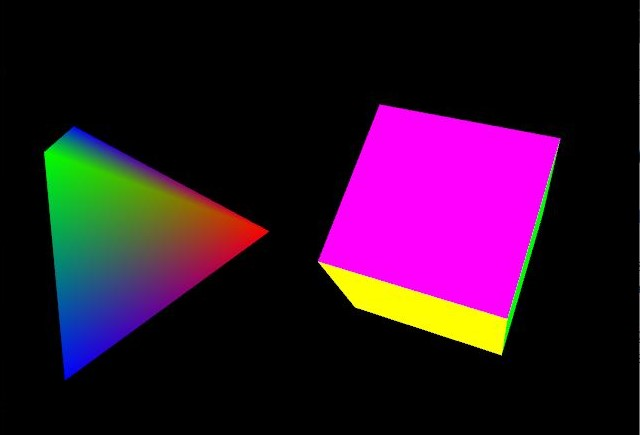
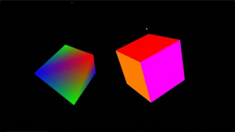

[Home](README.md) - [Code Review](CodeReview.md) - [Data Structures and Algorithms](data_structures.md) - [Software Engineering and Design](softeng_design.md) - [Databases](databases.md)

<h1> Software Engineering and Design </h1>

## Narrative

The artifact I want to use here is a final project from CS 330. I was asked to create a 3D model of an object of my choosing. I chose to create a cube and pryamid. This assignment was the most fun for me and I was very proud of the results. I feel this falls into software engineering and design area because it’s a small part of an overall major project. I went into this assignment knowing this is a small design project of a game or animated project. I plan to enhance the object with some better textures. 


## C++ 3D Objects (Cube and Pyramid)

```
#include <windows.h>  // for MS Windows
#include <GL/glut.h>  // GLUT, include glu.h and gl.h

/* Global variables */
char title[] = "3D Shapes";
GLfloat anglePyramid = 0.0f;   //Pyramid Rotates (enhancement)
GLfloat angleCube = 0.0f;      //Cube Rotates (enhancement)
int refreshMills = 20;         //Refresh Interval in Milliseconds (enhancement)

/* Initialize OpenGL Graphics */
void initGL() {
   glClearColor(0.0f, 0.0f, 0.0f, 1.0f); // Set background color to black and opaque
   glClearDepth(1.0f);                   // Set background depth to farthest
   glEnable(GL_DEPTH_TEST);   // Enable depth testing for z-culling
   glDepthFunc(GL_LEQUAL);    // Set the type of depth-test
   glShadeModel(GL_SMOOTH);   // Enable smooth shading
   glHint(GL_PERSPECTIVE_CORRECTION_HINT, GL_NICEST);  // Nice perspective corrections
}

/* Handler for window-repaint event. Called back when the window first appears and
   whenever the window needs to be re-painted. */
void display() {
   glClear(GL_COLOR_BUFFER_BIT | GL_DEPTH_BUFFER_BIT); // Clear color and depth buffers
   glMatrixMode(GL_MODELVIEW);     // To operate on model-view matrix

   // Render a color-cube consisting of 6 quads with different colors
   glLoadIdentity();                 // Reset the model-view matrix
   glTranslatef(1.5f, 0.0f, -7.0f);  // Move right and into the screen
   glRotatef(angleCube, 1.0f, 1.0f, 1.0f); //Rotates (1,1,1) on axis (enhancement)

   glBegin(GL_QUADS);                // Begin drawing the color cube with 6 quads
      // Top face (y = 1.0f)
      // Define vertices in counter-clockwise (CCW) order with normal pointing out
      glColor3f(0.0f, 1.0f, 0.0f);     // Green
      glVertex3f( 1.0f, 1.0f, -1.0f);
      glVertex3f(-1.0f, 1.0f, -1.0f);
      glVertex3f(-1.0f, 1.0f,  1.0f);
      glVertex3f( 1.0f, 1.0f,  1.0f);

      // Bottom face (y = -1.0f)
      glColor3f(1.0f, 0.5f, 0.0f);     // Orange
      glVertex3f( 1.0f, -1.0f,  1.0f);
      glVertex3f(-1.0f, -1.0f,  1.0f);
      glVertex3f(-1.0f, -1.0f, -1.0f);
      glVertex3f( 1.0f, -1.0f, -1.0f);

      // Front face  (z = 1.0f)
      glColor3f(1.0f, 0.0f, 0.0f);     // Red
      glVertex3f( 1.0f,  1.0f, 1.0f);
      glVertex3f(-1.0f,  1.0f, 1.0f);
      glVertex3f(-1.0f, -1.0f, 1.0f);
      glVertex3f( 1.0f, -1.0f, 1.0f);

      // Back face (z = -1.0f)
      glColor3f(1.0f, 1.0f, 0.0f);     // Yellow
      glVertex3f( 1.0f, -1.0f, -1.0f);
      glVertex3f(-1.0f, -1.0f, -1.0f);
      glVertex3f(-1.0f,  1.0f, -1.0f);
      glVertex3f( 1.0f,  1.0f, -1.0f);

      // Left face (x = -1.0f)
      glColor3f(0.0f, 0.0f, 1.0f);     // Blue
      glVertex3f(-1.0f,  1.0f,  1.0f);
      glVertex3f(-1.0f,  1.0f, -1.0f);
      glVertex3f(-1.0f, -1.0f, -1.0f);
      glVertex3f(-1.0f, -1.0f,  1.0f);

      // Right face (x = 1.0f)
      glColor3f(1.0f, 0.0f, 1.0f);     // Magenta
      glVertex3f(1.0f,  1.0f, -1.0f);
      glVertex3f(1.0f,  1.0f,  1.0f);
      glVertex3f(1.0f, -1.0f,  1.0f);
      glVertex3f(1.0f, -1.0f, -1.0f);
   glEnd();  // End of drawing color-cube

   // Render a pyramid consists of 4 triangles
   glLoadIdentity();                  // Reset the model-view matrix
   glTranslatef(-1.5f, 0.0f, -6.0f);  // Move left and into the screen
   glRotatef(anglePyramid, 1.0f, 1.0f, 0.0f);  //Rotates (1,1,1) on axis (enhancement)

   glBegin(GL_TRIANGLES);           // Begin drawing the pyramid with 4 triangles
      // Front
      glColor3f(1.0f, 0.0f, 0.0f);     // Red
      glVertex3f( 0.0f, 1.0f, 0.0f);
      glColor3f(0.0f, 1.0f, 0.0f);     // Green
      glVertex3f(-1.0f, -1.0f, 1.0f);
      glColor3f(0.0f, 0.0f, 1.0f);     // Blue
      glVertex3f(1.0f, -1.0f, 1.0f);

      // Right
      glColor3f(1.0f, 0.0f, 0.0f);     // Red
      glVertex3f(0.0f, 1.0f, 0.0f);
      glColor3f(0.0f, 0.0f, 1.0f);     // Blue
      glVertex3f(1.0f, -1.0f, 1.0f);
      glColor3f(0.0f, 1.0f, 0.0f);     // Green
      glVertex3f(1.0f, -1.0f, -1.0f);

      // Back
      glColor3f(1.0f, 0.0f, 0.0f);     // Red
      glVertex3f(0.0f, 1.0f, 0.0f);
      glColor3f(0.0f, 1.0f, 0.0f);     // Green
      glVertex3f(1.0f, -1.0f, -1.0f);
      glColor3f(0.0f, 0.0f, 1.0f);     // Blue
      glVertex3f(-1.0f, -1.0f, -1.0f);

      // Left
      glColor3f(1.0f,0.0f,0.0f);       // Red
      glVertex3f( 0.0f, 1.0f, 0.0f);
      glColor3f(0.0f,0.0f,1.0f);       // Blue
      glVertex3f(-1.0f,-1.0f,-1.0f);
      glColor3f(0.0f,1.0f,0.0f);       // Green
      glVertex3f(-1.0f,-1.0f, 1.0f);
   glEnd();   // Done drawing the pyramid

   glutSwapBuffers();  // Swap the front and back frame buffers (double buffering)

   //Updates rotation angle after each refresh (enhancement)
   anglePyramid += 0.2f;
   angleCube -= 0.15f;
}

void timer(int value) {
	glutPostRedisplay();    // Post re-paint request to activate display() (enhancement)
	glutTimerFunc(refreshMills, timer, 0);  // next timer call milliseconds later (enhancement)
}

/* Handler for window re-size event. Called back when the window first appears and
   whenever the window is re-sized with its new width and height */
void reshape(GLsizei width, GLsizei height) {  // GLsizei for non-negative integer
   // Compute aspect ratio of the new window
   if (height == 0) height = 1;                // To prevent divide by 0
   GLfloat aspect = (GLfloat)width / (GLfloat)height;

   // Set the viewport to cover the new window
   glViewport(0, 0, width, height);

   // Set the aspect ratio of the clipping volume to match the viewport
   glMatrixMode(GL_PROJECTION);  // To operate on the Projection matrix
   glLoadIdentity();             // Reset
   // Enable perspective projection with fovy, aspect, zNear and zFar
   gluPerspective(45.0f, aspect, 0.1f, 100.0f);
}

/* Main function: GLUT runs as a console application starting at main() */
int main(int argc, char** argv) {
   glutInit(&argc, argv);            // Initialize GLUT
   glutInitDisplayMode(GLUT_DOUBLE); // Enable double buffered mode
   glutInitWindowSize(640, 480);   // Set the window's initial width & height
   glutInitWindowPosition(50, 50); // Position the window's initial top-left corner
   glutCreateWindow(title);          // Create window with the given title
   glutDisplayFunc(display);       // Register callback handler for window re-paint event
   glutReshapeFunc(reshape);       // Register callback handler for window re-size event
   initGL();                       // Our own OpenGL initialization
   glutTimerFunc(0, timer, 0);     // First timer call immediately (enhancement)
   glutMainLoop();                 // Enter the infinite event-processing loop
   return 0;
}```

<center></center>


## Enhancements

The artifact is years old. It was originally designed as a basic introduction to creating 3D objects. It was a Program that creates a cube and a pyramid. With the enhancements, the 3b objects are better seen and represented in the 3d space. 
I chose this code because I felt it represents the foundation of a major project. 3D objects are the foundation of 3D animation and allow software for games and animation films. This basic code shows a peek of the overall design in creating stunning 3D visuals. I am proud of this coding because it shows my understanding of the space the 3D objects exist in. As detailed in my code review, both objects needed to be moved away from each other to avoid clipping. Then with the enhancement of becoming animated, that spacing became even more important as both objects don’t collide while moving. With this addition of animation, the visual of both 3D objects are showcased as each side can now be seen.

I believe I have met the objectives given. I wanted to enhance the project by showcasing 3D objects. Making them animated allows all sides of the object to be visible. I also wanted to update the textures but wasn’t getting the results I wanted.
I faced some issues with texture using pre-made jpg. I ran into this issue during the class itself but didn’t have this time to fix it for this milestone. I felt I was overwhelming myself with the addition of textures. What I found interesting is how easy it to apply the animation. I believe in research. If you don’t know something, look it up. My first impressions of animation were complex but once I looked into it, I was pleased to see that I was wrong. I enjoyed adding animation and how it can enrich the objects in the environment.


The enhancements below sets a starting angle for the two shapes and then sets each shape on a rotation that continues on a set pace. In doing this, each shape can be seen from all angles and the depth of the shapes can be seen. 
```
GLfloat anglePyramid = 0.0f;   //Pyramid Rotates (enhancement)
GLfloat angleCube = 0.0f;      //Cube Rotates (enhancement)
int refreshMills = 20;         //Refresh Interval in Milliseconds (enhancement)

glRotatef(angleCube, 1.0f, 1.0f, 1.0f); //Rotates (1,1,1) on axis (enhancement)(cube)
glRotatef(anglePyramid, 1.0f, 1.0f, 0.0f);  //Rotates (1,1,1) on axis (enhancement)(pyramid)

//Updates rotation angle after each refresh (enhancement)
   anglePyramid += 0.2f;
   angleCube -= 0.15f;
```

<center></center>


[Home](README.md) - [Code Review](CodeReview.md) - [Data Structures and Algorithms](data_structures.md) - [Software Engineering and Design](softeng_design.md) - [Databases](databases.md)
